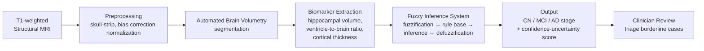

# FADE - Fuzzy-Assisted Diagnostic Evaluator for Dementia Staging

*A Volumetric MRI Decision-Support Tool to Reduce Diagnostic Workload in Clinical Neurology*

| Name | Reg. No. |
|---|---|
| Aryaditya Deshmukh | 23BCE5056 |
| Purusharth Kumar | 23BCE1908 |
| Punya Sirohi | 23BCE1917 |

---

## 1. Project Domain

Medical Image Analysis and Computational Intelligence - applying fuzzy logic and soft-computing
techniques to volumetric neuroimaging (structural MRI) for automated staging of Alzheimer's disease
(AD) and related dementias. The project sits at the intersection of:

- Biomedical image processing (MRI preprocessing, segmentation, volumetry)
- Uncertainty-aware machine learning (fuzzy inference vs. hard-label classifiers)
- Clinical decision support (workflow integration, not just algorithmic accuracy)

## 2. Problem Statement

Dementia progresses along a continuum - **Cognitively Normal (CN) → Mild Cognitive Impairment (MCI)
→ Alzheimer's Disease (AD)** - that is genuinely hard to separate from structural MRI alone, especially
in early or borderline cases. Today:

- Neurologists manually estimate volumetric change across a growing patient load - slow and
  cognitively demanding.
- Conventional automated classifiers emit a single **hard label**, hiding the diagnostic uncertainty
  that actually matters when a biomarker (e.g. hippocampal volume) sits between "normal" and
  "atrophied."
- Prior fuzzy-logic AD-staging work has been validated almost exclusively on public benchmarks
  (ADNI, OASIS) and rarely tested against **heterogeneous real clinical scans**, and rarely designed
  around day-to-day clinical workflow.

**FADE's proposition:** extract volumetric biomarkers from T1-weighted structural MRI, pass them
through a fuzzy inference system that outputs a **dementia stage + a confidence/uncertainty score**
(not just a label), and use that score to triage - so a neurologist spends review time on genuinely
uncertain cases instead of re-examining every scan from scratch. The goal is workload *reduction*,
not workload *replacement*.

## 3. Proposed Pipeline



**Why fuzzy logic, specifically:** biomarkers like hippocampal volume don't have a hard cutoff between
"normal" and "atrophied" - they degrade continuously and overlap across stages. A fuzzy inference
system (FIS) models that overlap natively via membership functions, rather than forcing a threshold a
hard classifier would need. The rule base is where clinical domain expertise gets encoded directly
(see §5), which is also what keeps the system interpretable to a neurologist, unlike a black-box
CNN.

## 4. Key Differentiators

- **Confidence/uncertainty output, not just a label.** Directly enables the "triage" workflow the
  project targets - the whole point is to reduce clinician workload, not just classify.
- **Real clinical data, not benchmark-only.** Validated on anonymized scans from an active neurology
  practice in addition to OASIS/ADNI, addressing the generalization gap left open by prior studies
  (see reference [1]–[4], [7]).
- **Clinician-in-the-loop rule design.** Fuzzy rules are shaped with a practicing neurologist rather
  than tuned purely to benchmark accuracy.

## 5. Clinical Collaboration

The project is being undertaken in direct collaboration with **Dr. Devdutt Deshmukh, MD, DNB**, a
practicing neurologist. His role:

- Guides feature selection and fuzzy rule design from clinical experience.
- Reviews system staging output against real diagnostic judgment.
- Facilitates access to anonymized patient MRI scans for real-world validation, subject to informed
  consent.

This is a hard dependency for Phase 1 (ethics/consent) and Phase 7 (real-world validation) below -
plan around his availability, not just team bandwidth.

## 6. Datasets

| Dataset | Role | Access |
|---|---|---|
| OASIS | Primary public benchmark - train/validate FIS and biomarker pipeline | Open, registration required |
| ADNI | Secondary public benchmark, used "where access permits" | Requires application/approval - apply early, this can take weeks |
| Clinic scans (anonymized) | Real-world validation, generalization test | Via Dr. Deshmukh's clinic, subject to informed consent + anonymization |

## 7. Tech Stack

- **Backend:** built - see [`backend/`](backend/) (FastAPI + async SQLAlchemy 2.0 + Pydantic v2,
  JWT auth, Alembic migrations, SQLite for local dev / Postgres in Docker). Implements the actual
  Phase 2–6 pipeline: `nibabel`/`numpy`/`scipy`/`scikit-image` for preprocessing and volumetry, and a
  hand-built multi-antecedent **Mamdani fuzzy inference engine** (not `scikit-fuzzy` - see
  [`backend/README.md`](backend/README.md) for why) with 10 explicit clinical rules over three
  independently-fuzzified biomarkers. Runs end-to-end today against a synthetic MRI phantom
  (`backend/app/services/synthetic_mri.py`) in place of the real OASIS/ADNI/clinic data Phase 1
  hasn't unblocked yet - every other stage of the pipeline (preprocessing, segmentation, biomarker
  extraction, fuzzy inference) is real, not mocked.
- **Decision-support UI:** built and wired to the live API - see [`frontend/`](frontend/) (Vite +
  React 19 + TypeScript + Tailwind CSS v4 + Radix/shadcn-style components + Recharts + Framer Motion +
  TanStack Query). Talks to `backend/` over a camelCase JSON REST contract with JWT auth; the frontend
  never computes anything clinical - every fuzzy-logic number it renders (stage, confidence,
  uncertainty, fired rules, membership curves) comes straight from the API. Covered by a vitest + React
  Testing Library suite (`frontend/`'s `npm test`) alongside the backend's pytest suite.
- **Evaluation (Phase 6, not yet built):** scikit-learn (metrics), pandas - for benchmarking against
  OASIS/ADNI once Phase 1 dataset access lands.

## 8. Repository Structure

```
pjt1/
├── backend/                # ✅ built - FastAPI + fuzzy inference engine + MRI pipeline, see backend/README.md
├── frontend/               # ✅ built - decision-support dashboard, wired to the live API, see frontend/README.md
├── .github/workflows/      # CI - lint/typecheck/test on every PR, see ci.yml
├── docker-compose.yml      # full stack: Postgres + FastAPI + React (nginx) - see §12 below
├── docs/                  # rule-base design notes, clinician review notes, reports (not yet started)
├── PHASES.md
└── README.md
```

`backend/`'s and `frontend/`'s own internal layouts are documented in their respective READMEs rather
than duplicated here.

## 9. Project Phases

See [PHASES.md](PHASES.md) for the full phase-by-phase breakdown (goals, tasks, deliverables,
dependencies, and risks per phase).

**Summary:**

| # | Phase | Focus |
|---|---|---|
| 0 | Foundation & Literature Review | Done - 7 papers reviewed, gap identified |
| 1 | Requirements, Ethics & Data Access | IRB/consent, dataset applications - **still open, blocks Phase 7** |
| 2 | Data Acquisition & Preprocessing | **Built** in [`backend/`](backend/) - runs on a synthetic MRI phantom pending Phase 1 |
| 3 | Volumetric Feature Extraction | **Built** - hippocampal volume, VBR, cortical thickness, real segmentation code |
| 4 | Fuzzy Inference System Design | **Built** - 10-rule Mamdani engine; rules are illustrative, not yet clinician-reviewed |
| 5 | System Integration | **Built** - MRI in → stage + confidence out, exercised via a live REST API |
| 6 | Benchmark Validation | Not started - blocked on Phase 1 (no OASIS/ADNI data loaded yet) |
| 7 | Real-World Clinical Validation | Blocked on Phase 1 (clinic consent/ethics) |
| 8 | Decision-Support Interface | **Built and wired to `backend/`** - live login, real patient/scan data, real-time processing states |
| 9 | Evaluation & Iteration | Refine rules against clinical feedback |
| 10 | Documentation & Presentation | Final report, demo, paper writeup |

**Immediate next step, unblocked today:** the clinician-review conversation Phase 4 has always needed
(§5) - the rule base and biomarker breakpoints are implemented and demoable end-to-end, but still
literature-informed guesses rather than something Dr. Deshmukh has looked at.

## 10. Success Metrics

- **Staging accuracy / agreement** vs. ground-truth labels on OASIS (and ADNI if access is granted).
- **Clinician agreement (e.g. Cohen's κ)** between FADE's stage output and Dr. Deshmukh's independent
  read on the real clinic scans.
- **Uncertainty calibration** - do low-confidence outputs actually correlate with cases the clinician
  finds genuinely borderline? This is the metric that validates the *workload-reduction* claim, not
  just raw accuracy.
- **Qualitative clinician feedback** on whether the tool's triage would plausibly save review time in
  a real clinic.

## 11. Key Risks

| Risk | Mitigation |
|---|---|
| ADNI access delayed/denied | Treat OASIS as primary; apply for ADNI early in Phase 1, don't block on it |
| IRB/consent process for real clinic scans takes longer than expected | Start Phase 1 ethics track in parallel with Phase 2-3 technical work, not after |
| Real clinical scans are heterogeneous (different scanners/protocols vs. OASIS/ADNI) | Build preprocessing/normalization robust to this from the start; treat it as a Phase 2 design constraint, not a Phase 7 surprise |
| Rule base overfits to one clinician's judgment | Cross-check rules against literature ([2],[4]) in addition to Dr. Deshmukh's input |
| MCI class is inherently ambiguous (hardest of the three stages) | Expect and report lower confidence scores here rather than forcing false precision |

## 12. Running It

**Docker (full stack - the fastest path to a working instance):**

```bash
cp .env.example .env   # set SECRET_KEY - the file explains how to generate one
docker compose up --build
```

Brings up Postgres, the API (migrations applied automatically on container start), and the frontend
(a static Vite build served by nginx) - reachable at `http://localhost:5173`, talking to the API at
`http://localhost:8000`. Each half also has its own standalone `Dockerfile` and its own README with
local (non-Docker) setup instructions: [`backend/README.md`](backend/README.md),
[`frontend/README.md`](frontend/README.md).

## 13. Continuous Integration

[`.github/workflows/ci.yml`](.github/workflows/ci.yml) runs on every pull request:

- **Backend:** `ruff check`, `mypy`, `pytest` (isolated in-memory SQLite, per the backend's own test
  design), plus a separate `alembic upgrade head` smoke test against a real ephemeral Postgres service
  container - migrations can behave differently there than on SQLite, so this is checked independently
  of the pytest run rather than assumed.
- **Frontend:** `tsc --noEmit`, `oxlint`, `vitest run`.

Either half failing blocks the merge.

## 14. References

Reviewed to establish feasibility, methodology, and novelty:

1. *Diagnosing early stages of Alzheimer's diseases based on volumetric features from MRI using soft
   computing algorithms.* Multimedia Tools and Applications, Springer Nature (2025).
   https://link.springer.com/article/10.1007/s11042-025-20732-2
2. *Application of fuzzy logic for Alzheimer's disease diagnosis.* ResearchGate (2015).
   https://www.researchgate.net/publication/285228407_Application_of_fuzzy_logic_for_Alzheimer's_disease_diagnosis
3. *A novel CNN–fuzzy–XAI approach for Alzheimer's disease severity classification using brain MRI
   scans.* Cogent Engineering, Taylor & Francis (2025).
   https://www.tandfonline.com/doi/full/10.1080/23311916.2025.2575105
4. *A fuzzy-based system reveals Alzheimer's Disease onset in subjects with Mild Cognitive
   Impairment.* PubMed. https://pubmed.ncbi.nlm.nih.gov/28610695/
5. *Integrating Demographics and Imaging Features for Various Stages of Dementia Classification: Feed
   Forward Neural Network Multi-Class Approach.* PMC.
   https://www.ncbi.nlm.nih.gov/pmc/articles/PMC11047992/
6. *3D MRI-Based Alzheimer's Disease Classification Using Multi-Modal 3D CNN with Leakage-Aware
   Subject-Level Evaluation.* arXiv (2026). https://arxiv.org/pdf/2603.17304
7. *Computer-Aided Diagnosis System of Alzheimer's Disease Based on Multimodal Fusion: Tissue
   Quantification Based on the Hybrid Fuzzy-Genetic-Possibilistic Model and Discriminative
   Classification Based on the SVDD Model.* PMC. https://www.ncbi.nlm.nih.gov/pmc/articles/PMC6826987/

## 15. Note on Data Ethics

This project involves real, identifiable patient MRI data prior to anonymization. Do not commit any
patient data, DICOM headers, or clinic records to this repository at any point - `data/` should stay
gitignored, and only de-identified, consented, processed data should ever leave the clinical
environment.
